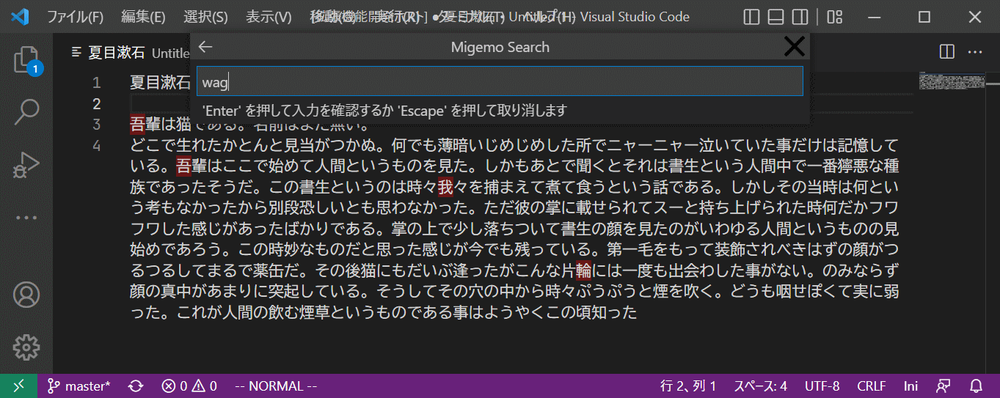

# migemo-vscode

VSCode上でローマ字のまま日本語の単語を検索できるMigemo検索を利用するための、拡張機能（エクステンション）です。

## 使い方

拡張機能をインストール後、コマンドパレット(Ctrl+P)を開き、「Migemo Search」を検索してクリックします。

検索ウインドウが表示されたら、検索したい単語をローマ字で入力します。
すると、入力に該当する単語がハイライトされます。
そのままエンターを押すと、ハイライトが確定され、検索ウインドウを消してもハイライトが保持されます。

ハイライトを取り消すには、入力を空にしてエンターを押すか、検索ウインドウ右上の「✕」ボタンを押してください。